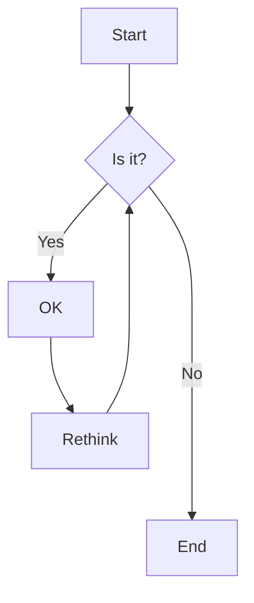



# Supply Chains as Complex Systems
Networks to distribute goods, from raw materials to food and medicines, are the backbone of a functioning economy. They are shaped by several supply relations connecting manufacturers, distributors, and final buyers worldwide. The aggregation of these relations give rise to intricate supply chains that grow more complex every year [1, 2]. This has recently revealed some significant downsides. The Covid-19 pandemic and the conflict in Ukraine have highlighted that even local shortages can be amplified through the supply linkages and ultimately affect millions of people [3–6]. As supply chains grow more complex, they also raise pressing sustainability concerns, regarding environmental degradation, poor labour conditions, and red-flag social issues [7-10]. These events have called for a deeper understanding of supply chain structures and how these structures affect their resilience and sustainability [11].

Traditionally, scholars of supply chain management and operations logistics have conceptualized distribution systems as linear chains. Using this perspective implies that supply chains in principle can be fully designed by a single manufacturer [12–14]. However, nowadays, this conventional approach falls short. While firms could choose their partners, they have limited control over the business relations of those partners [15]. In other words, the connections within the distribution system extend beyond the control of a single entity, and the resulting structure strongly deviates from a simple chain. Thus, today’s distribution systems should be better viewed as self-organized systems emerging from the interactions of several firms [16, 17]. As recently highlighted [15, 18–20], these self-organized systems can be suitably represented as complex networks. Network science has provided tools to move beyond the oversimplified chain perspective. Yet, research in this direction has been limited by a lack of comprehensive data. Given this limitation, previous research has been constrained to small-scale case studies [21, 22] or simulations without empirical validation [13, 20–25]. Network models validated on large-scale distribution systems are still missing [15].




# Satellite Overview
We advance this research by proposing a satellite that addresses key challenges in supply chain networks. The satellite aims to foster interdisciplinary discussions and identify research gaps by bringing together experts from network science, operations research, and supply chain management. The primary objectives are to explore sustainability of modern supply chains, analyze similarity and differences depending on categories of goods, and compare micro- and macro-level properties of distribution networks. The satellite also welcomes contributions discussing new data and methodological advancements useful for the field.




- **Environmental:** Impact of distribution networks on carbon footprints, energy consumption, and resource depletion.
- **Economic:** The resilience of supply chains to market fluctuations, cost optimization, and trade policies.
- **Social:** Ethical sourcing, labor practices, and equitable access to goods.





- **Essential Goods:** Distribution of food and medicine, and resilience against disruptions.
- **Renewable Resources:** Sustainable sourcing and efficient distribution of renewable materials. Circularity, cascading, and re-use.
- **Rare Earth Elements:** Challenges associated with geopolitical dependencies and strategic resource management.





- **Trade-offs:** Balancing resilience and cost-effectiveness in supply chains.
- **Micro vs Macro:** Firm-level efficiency does not always translate to system-level efficiency. Understanding this mismatch calls for system thinking and models of complex systems.
- **Systemic Risk:** Identifying vulnerabilities in global supply chains and strategies for mitigation.




- **Data Sets:** Data of regional and global supply chain networks, focusing on large-scale datasets that capture real-world complexities.
- **Network and Agent-Based Models:** Development and applications of network science and agent-based simulations to model emergent behaviors in supply chain structures.
- **Optimization Methods:** Mathematical and computational techniques to enhance supply chain performance and resilience.




# Do you want to join us?

We invite researchers to submit manuscripts contributing to the discussion on supply chains as complex systems. Topics of interest include, but are not limited to, sustainability, resilience, efficiency, network models, and data-driven approaches.



- Accepted topics: Sustainability, resilience, efficiency, data, and network models.
- Send us an extended abstract: format as for the main conference ([**here for more info**](https://ccs25.cssociety.org/abstract-2/))
- Accepted contributions will be presented at the satellite as contributed talks.


<!-- 
 - **Sustainability**
    - Environmental: Impact of distribution networks on carbon footprints, energy consumption, and resource depletion.
    - Economic: The resilience of supply chains to market fluctuations, cost optimization, and trade policies.
    - Social: Ethical sourcing, labor practices, and equitable access to goods.
 - **Goods under analysis**
    - Essential Goods: Distribution of food and medicine, and resilience against disruptions.
    - Renewable Resources: Sustainable sourcing and efficient distribution of renewable materials. Circularity, cascading, and re-use.
    - Rare Earth Elements: Challenges associated with geopolitical dependencies and strategic resource management.
 - **Resilience and Efficiency**
    - Trade-offs: Balancing resilience and cost-effectiveness in supply chains.
    - Micro vs Macro: Firm-level efficiency does not always translate to system-level efficiency. Understanding this mismatch calls for system thinking and models of complex systems.
    - Systemic Risk: Identifying vulnerabilities in global supply chains and strategies for mitigation.
 - **Data and Methods**
    - Data Sets: Data of regional and global supply chain networks, focusing on large-scale datasets that capture real-world complexities.
    - Network and Agent-Based Models: Development and applications of network science and agent-based simulations to model emergent behaviors in supply chain structures.
    - Optimization Methods: Mathematical and computational techniques to enhance supply chain performance and resilience. -->

# Organizers



### References
1. Bode C, Wagner SM (2015) Structural drivers of upstream supply chain complexity and the frequency of supply chain disruptions. J Oper Manag 36:215–228
2. Akın Ate¸s M, Suurmond R, Luzzini D, Krause D (2022) Order from chaos: a meta-analysis of supply chain complexity and firm performance. Supply Chain Manag 58(1):3–30
3. Trump BD, Linkov I (2020) Risk and resilience in the time of the covid-19 crisis. Environ Syst Decis 40(2):171–173
4. Ivanov D (2021) Supply chain viability and the covid-19 pandemic: a conceptual and formal generalisation of four major adaptation strategies. Int J Prod Res 59(12):3535–3552
5. Allam Z, Bibri SE, Sharpe SA (2022) The rising impacts of the covid-19 pandemic and the Russia–Ukraine war: energy transition, climate justice, global inequality, and supply chain disruption. Resources 11(11):99
6. Farrell H, Newman AL (2022) Weak links in finance and supply chains are easily weaponized. Nature 605(7909):219–222
7. Brockhaus S, Kersten W, Knemeyer AM (2013) Where do we go from here? Progressing sustainability implementation efforts across supply chains. J Bus Logist 34(2) 167-182
8. Villena VH (2018) The Missing Link? The Strategic Role of Procurement in Building Sustainable Supply Networks. Prod Oper Manag 28(5):1149–1172
9. Awaysheh A, Klassen RD (2010) The impact of supply chain structure on the use of supplier socially responsible practices. Int J Oper Prod Manag 30(12)
10. Villena VH, Gioia DA (2018) On the riskiness of lower-tier suppliers: Managing sustainability in supply networks. J Oper Manag 64(1):65–877.
11. Whitehouse T (2021) National Strategy for a Resilient Public Health Supply Chain. Technical report 
12. Schwartz F, Voß S (2007) Distribution network design with postponement. Wirtsch Proc 2007:78
13. Wang G, Gunasekaran A, Ngai EW (2018) Distribution network design with big data: model and analysis. Ann Oper Res 270(1):539–551
14. Altiparmak F, Gen M, Lin L, Karaoglan I (2009) A steady-state genetic algorithm for multi-product supply chain network design. Comput Ind Eng 56(2):521–537
15. Brintrup A, Ledwoch A (2018) Supply network science: emergence of a new perspective on a classical field. Chaos, Interdiscip J Nonlinear Sci 28(3):033120
16. Choi TY, Dooley KJ, Rungtusanatham M (2001) Supply networks and complex adaptive systems: control versus emergence. J Oper Manag 19(3):351–366
17. Pathak SD, Day JM, Nair A, Sawaya WJ, Kristal MM (2007) Complexity and adaptivity in supply networks: building supply network theory using a complex adaptive systems perspective. Decis Sci 38(4):547–580
18. Hearnshaw EJ, Wilson MM (2013) A complex network approach to supply chain network theory. Int J Oper Prod Manag 33(4):442–469
19. Ivanov D, Dolgui A (2020) Viability of intertwined supply networks: extending the supply chain resilience angles towards survivability. A position paper motivated by covid-19 outbreak. Int J Prod Res 58(10):2904–2915
20. Inoue H, Todo Y (2019) Firm-level propagation of shocks through supply-chain networks. Nat Sustain 2(9):841–847
21. Luo J, Baldwin CY, Whitney DE, Magee CL (2012) The architecture of transaction networks: a comparative analysis of hierarchy in two sectors. Ind Corp Change 21(6):1307–1335
22. Potter A, Wilhelm M (2020) Exploring supplier–supplier innovations within the Toyota supply network: a supply network perspective. J Oper Manag 66(7–8):797–819
23. Spiegler VL, Naim MM, Wikner J (2012) A control engineering approach to the assessment of supply chain resilience. Int J Prod Res 50(21):6162–6187
24. Chakraborty T, Chauhan SS, Ouhimmou M (2020) Mitigating supply disruption with a backup supplier under uncertain demand: competition vs. cooperation. Int J Prod Res 58(12):3618–3649
25. Fahimnia B, Jabbarzadeh A, Sabouhi F (2017) Sustainability analysis under disruption risks. (WORKING PAPER)
26. Lipmanowicz, H., & McCandless, K. (2013). The Surprising Power of Liberating Structures: Simple Rules to Unleash a Culture of Innovation. Liberating Structures Press.

<!-- 
Here is an example of headings. You can use this heading by the following markdown rules. For example: use `#` for heading 1 and use `######` for heading 6.

# Heading 1

## Heading 2

### Heading 3

#### Heading 4

##### Heading 5

###### Heading 6

<hr>

### Emphasis

The emphasis, aka italics, with _asterisks_ or _underscores_.

Strong emphasis, aka bold, with **asterisks** or **underscores**.

The combined emphasis with **asterisks and _underscores_**.

Strike through uses two tildes. ~~Scratch this.~~

<hr>

### Button



<hr>

### Link

[I'm an inline-style link](https://www.google.com)

[I'm an inline-style link with title](https://www.google.com "Google's Homepage")

[I'm a reference-style link][Arbitrary case-insensitive reference text]

[I'm a relative reference to a repository file](../blob/master/LICENSE)

[You can use numbers for reference-style link definitions][1]

Or leave it empty and use the [link text itself].

URLs and URLs in angle brackets will automatically get turned into links.
<http://www.example.com> or <http://www.example.com> and sometimes
example.com (but not on Github, for example).

Some text to show that the reference links can follow later.

[arbitrary case-insensitive reference text]: https://www.themefisher.com
[1]: https://gethugothemes.com
[link text itself]: https://www.getjekyllthemes.com

<hr>

### Paragraph

Lorem ipsum dolor sit amet consectetur adipisicing elit. Quam nihil enim maxime corporis cumque totam aliquid nam sint inventore optio modi neque laborum officiis necessitatibus, facilis placeat pariatur! Voluptatem, sed harum pariatur adipisci voluptates voluptatum cumque, porro sint minima similique magni perferendis fuga! Optio vel ipsum excepturi tempore reiciendis id quidem? Vel in, doloribus debitis nesciunt fugit sequi magnam accusantium modi neque quis, vitae velit, pariatur harum autem a! Velit impedit atque maiores animi possimus asperiores natus repellendus excepturi sint architecto eligendi non, omnis nihil. Facilis, doloremque illum. Fugit optio laborum minus debitis natus illo perspiciatis corporis voluptatum rerum laboriosam.

<hr>

### Ordered List

1. List item
2. List item
3. List item
4. List item
5. List item

<hr>

### Unordered List

- List item
- List item
- List item
- List item
- List item

<hr>

### Notice


This is a simple note.



This is a simple tip.



This is a simple info.



This is a simple warning.


<hr>

### Tab




#### Hey There, I am a tab

Lorem ipsum dolor sit amet, consetetur sadipscing elitr, sed diam nonumy eirmod tempor invidunt ut labore et dolore magna aliquyam erat, sed diam voluptua. At vero eos et accusam et justo duo dolores et ea rebum. Stet clita kasd gubergren, no sea takimata sanctus est Lorem ipsum dolor sit amet.





#### I wanna talk about the assassination attempt

Lorem ipsum dolor sit amet, consetetur sadipscing elitr, sed diam nonumy eirmod tempor invidunt ut labore et dolore magna aliquyam erat, sed diam voluptua. At vero eos et accusam et justo duo dolores et ea rebum. Stet clita kasd gubergren, no sea takimata sanctus est Lorem ipsum dolor sit amet.

Lorem ipsum dolor sit amet, consetetur sadipscing elitr, sed diam nonumy eirmod tempor invidunt ut labore et dolore magna aliquyam erat, sed diam voluptua. At vero eos et accusam et justo duo dolores et ea rebum. Stet clita kasd gubergren, no sea takimata sanctus est Lorem ipsum dolor sit amet.





#### We know you’re dealing in stolen ore

Lorem ipsum dolor sit amet, consetetur sadipscing elitr, sed diam nonumy eirmod tempor invidunt ut labore et dolore magna aliquyam erat, sed diam voluptua. At vero eos et accusam et justo duo dolores et ea rebum. Stet clita kasd gubergren, no sea takimata sanctus est Lorem ipsum dolor sit amet.

Lorem ipsum dolor sit amet, consetetur sadipscing elitr, sed diam nonumy eirmod tempor invidunt ut labore et dolore magna aliquyam erat, sed diam voluptua. At vero eos et accusam et justo duo




<hr>

### Accordions



- Lorem ipsum dolor sit amet consectetur adipisicing elit.
- Lorem ipsum dolor sit amet consectetur adipisicing elit.
- Lorem ipsum dolor sit amet consectetur





- Lorem ipsum dolor sit amet consectetur adipisicing elit.
- Lorem ipsum dolor sit amet consectetur adipisicing elit.
- Lorem ipsum dolor sit amet consectetur





- Lorem ipsum dolor sit amet consectetur adipisicing elit.
- Lorem ipsum dolor sit amet consectetur adipisicing elit.
- Lorem ipsum dolor sit amet consectetur



<hr>

### Code and Syntax Highlighting

This is an `Inline code` sample.

```javascript
var s = "JavaScript syntax highlighting";
alert(s);
```

```python
s = "Python syntax highlighting"
print s
```

```c  { linenos=true }
#include <stdio.h>

int main(void)
{
    printf("hello, world\n");
    return 0;
}
```



<hr>

### Blockquote

> Did you come here for something in particular or just general Riker-bashing? And blowing into maximum warp speed, you appeared for an instant to be in two places at once.

<hr>

### Tables

| Tables        |      Are      |  Cool |
| ------------- | :-----------: | ----: |
| col 3 is      | right-aligned | $1600 |
| col 2 is      |   centered    |   $12 |
| zebra stripes |   are neat    |    $1 |

<hr>

### Image



<hr>

### Gallery



<hr>

### Slider



<hr>

### Youtube video



<hr>

### Custom video

 -->
